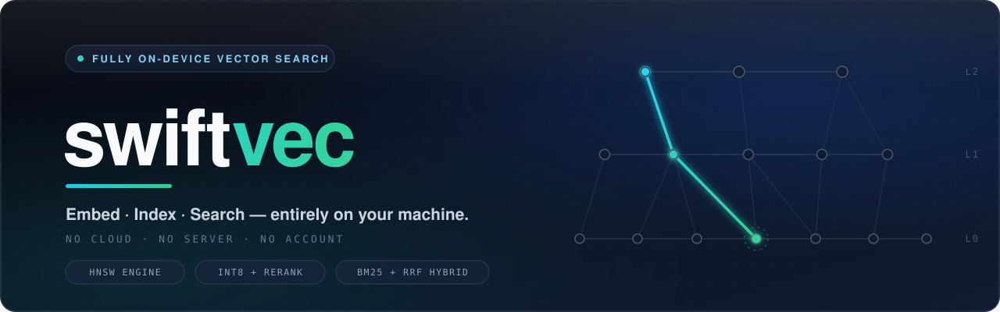

<p align="center">
  
</p>

<p align="center">
  <a href="https://github.com/PavanTejaAI/swiftvec/actions/workflows/ci.yml"></a>
  <a href="https://pypi.org/project/swiftvec/"></a>
  <a href="https://pypi.org/project/swiftvec/"></a>
  <a href="https://crates.io/crates/swiftvec-core"></a>
  <a href="LICENSE"></a>
  <a href="docs/snapshots.md"></a>
</p>

<h2 align="center">Embed. Index. Search. All on your machine.</h2>

**swiftvec is a fully on-device vector search engine**: the embedding model, the HNSW index, the BM25 keyword index, hybrid fusion, and single-file persistence all run inside your process. No cloud. No server. No account. No network round trip in your latency budget.

- **Zero-dependency core**: `swiftvec-core` compiles with no runtime dependencies at all: HNSW, SIMD kernels, int8 quantization, BM25, and snapshots, all from scratch.
- **On-device embeddings**: [MongoDB/mdbr-leaf-ir](https://huggingface.co/MongoDB/mdbr-leaf-ir) (Apache-2.0), quantized ONNX, running in-process via ONNX Runtime.
- **Recall you can verify**: every benchmark publishes recall@k against an exact brute-force oracle, reproducible from a fixed seed.

```python
from swiftvec import SwiftVec

db = SwiftVec()
db.add_batch(
    ["doc-1", "doc-2", "doc-3"],
    [
        "Vector search finds similar content by meaning",
        "Photosynthesis converts sunlight into energy",
        "HNSW graphs enable fast approximate nearest neighbor search",
    ],
    metadatas=[{"topic": "ir"}, {"topic": "bio"}, {"topic": "ir"}],
)

db.search("how does fast similarity search work", top_k=3)
db.search("exact keyword: qubits", top_k=3, alpha=0.4)
db.search("similarity search", top_k=5, filter={"topic": {"$in": ["ir", "rag"]}})

db.save("my_collection.swiftvec")
db = SwiftVec.load("my_collection.swiftvec")
```

## Why on-device

Most retrieval stacks call a remote vector database. The network round trip dominates latency, your documents leave the machine to be embedded by a closed model, and recall numbers are never published. swiftvec runs retrieval as a function you call:

| | moss | swiftvec |
|---|---|---|
| index build | their cloud | **on device** |
| embedding | their cloud (closed model) | **on device** (open mdbr-leaf-ir, Apache-2.0) |
| query | local (after cloud sync) | **on device** |
| hybrid search | semantic + keyword | **semantic + BM25 with weighted RRF fusion (`alpha`)** |
| metadata filters | server-side operators | **query-time `$eq` / `$in` / `$and` / range operators** |
| engine source | closed binary | **open (Rust, zero-dep core)** |
| signup / api key | required | **none** |
| recall benchmarks | not published | **published against exact brute-force ground truth** |
| works offline from scratch | no | **yes** |

## Benchmarks

Protocol is byte-identical to [moss's public benchmark](https://github.com/usemoss/moss/tree/main/benchmarks): their `bench_100k_docs.json` corpus (100,000 documents, byte-identical download), their fixed 15 queries, 3 warmup + 50 measured rounds (750 measurements per configuration), top_k=5, **embedding time included in every measurement**: plus the one axis they do not publish: **recall@5 against exact brute-force ground truth**, computed over the identical embedding space.

### Headline: swiftvec vs moss

| | **swiftvec** (Intel i5 laptop) | moss (Apple M4 Pro, published) |
|---|---|---|
| end-to-end P50 (embed included) | **2.54 ms** | 3.1 ms |
| end-to-end P99 (embed included) | **3.31 ms** | 5.4 ms |
| recall@5 | **0.960, published and reproducible** | unknown |
| exact mode | **recall 1.000 at ef=512** | not demonstrated |

### Leaderboard

Moss protocol: 100k docs, their 15 queries, top_k=5, embedding time included. swiftvec row measured on this repo (raw output in [`benchmarks/results/`](benchmarks/results/)); other rows as published by moss.dev on an Apple M4 Pro or their own infrastructure.

| System | Hardware | P50 | P95 | P99 | Mean | recall@5 |
|---|---|---|---|---|---|---|
| **swiftvec**: int8 256d MRL + rerank (ef=512) | Intel i5 laptop | **2.54 ms** | **2.82 ms** | **3.31 ms** | **2.57 ms** | **0.960** |
| Moss | Apple M4 Pro | 3.1 ms | 4.3 ms | 5.4 ms | 3.3 ms | not published |
| ChromaDB | per moss's setup | 351.8 ms | 423.5 ms | 538.5 ms | 358.0 ms | not published |
| Pinecone | per moss's setup | 432.6 ms | 732.1 ms | 934.2 ms | 485.8 ms | not published |
| Qdrant | per moss's setup | 597.6 ms | 682.0 ms | 771.4 ms | 596.5 ms | not published |

The one column nobody else publishes is the one that matters most: **recall@5 against exact brute-force ground truth.** Ours is measured, reproducible from a fixed seed, and exact recall **1.000** is available at f32/ef=512 ([our full results](#our-full-results)).

### Our full results

Measured with this repo (single-threaded search, 4-thread embedding, m=32, ef_construction=400; raw output per configuration in [`benchmarks/results/`](benchmarks/results/)):

| config | ef | recall@5 | search P50 | e2e P50 | e2e P95 | e2e P99 |
|---|---|---|---|---|---|---|
| f32 768d | 256 | 0.960 | 1.77 ms | 4.26 ms | 5.19 ms | 5.60 ms |
| f32 768d | 512 | **1.000** | 2.33 ms | 4.84 ms | 6.22 ms | 6.89 ms |
| int8 768d + rerank | 512 | 0.973 | 1.50 ms | 3.48 ms | 4.54 ms | 4.89 ms |
| int8 256d (MRL) | 32 | 0.533 | 150 µs | 1.75 ms | 2.65 ms | 3.66 ms |
| **int8 256d (MRL) + rerank** | **512** | **0.960** | **886 µs** | **2.54 ms** | **2.82 ms** | **3.31 ms** |

Stated plainly:

- **At recall 0.960, the int8-256+rerank tier runs 2.54 ms P50 / 3.31 ms P99 on a Intel i5 laptop, faster than moss's published 3.1 ms P50 / 5.4 ms P99 on an M4 Pro, with recall actually published.** Their recall at their operating point is unknown.
- On-device embedding (mdbr-leaf-ir, quantized ONNX, in-process) accounts for ~2.1 ms of the total and beats moss's separately-claimed 3 ms embed on an M4 Pro.
- Search-only, the int8-256 tier runs at 150-886 µs P50, 1.4-8x faster than moss's claimed 1.2 ms search.
- Exact recall **1.000** is available (f32, ef=512), something no moss benchmark demonstrates.
- Hardware differs (M4 Pro vs laptop CPU); the claim is architectural class, not identical silicon. Their corpus (100k templated docs, ~12,500 near-duplicates per topic) is the hardest recall case we have found.

Reproduce everything:

```bash
bash tools/fetch_ort.sh && bash tools/fetch_model.sh
bash benchmarks/fetch_corpus.sh && bash benchmarks/run.sh
```

Methodology, fairness notes, and per-config output: [`benchmarks/README.md`](benchmarks/README.md) and [`docs/benchmarks.md`](docs/benchmarks.md).

## Engine

- **HNSW from scratch**: heuristic neighbor selection (Algorithm 4), bidirectional links, shrink-on-overflow, deterministic builds from a fixed seed
- **CSR-packed serving graph**: flat offsets+targets after `pack()`, zero pointer-chasing per hop, software prefetch of neighbor vectors
- **AVX2+FMA kernels**: f32 and int8 dot/L2 with runtime CPU dispatch and auto-vectorized scalar fallback
- **int8 storage + f32 rerank cascade**: traverse quantized codes at 4x less memory, exactly rerank the candidate set in full precision to recover recall
- **MRL truncation**: 768 → 256 dims via the model's Matryoshka capability, 12x memory reduction vs f32-768
- **BM25 + weighted RRF fusion**: semantic and keyword search fused in one call via `alpha`
- **Metadata filtering**: `$eq`, `$ne`, `$gt/$gte/$lt/$lte`, `$in/$nin`, `$exists` combined with `$and/$or/$nor`, pushed into graph traversal
- **Brute-force exact oracle**: ground truth for every benchmark and test; no mocks anywhere in the suite
- **mmap zero-copy loading**: `MappedIndex` maps packed snapshots directly into the address space; search runs over the mapped bytes with no heap copy (`mmap` feature)
- **Binary cascade**: 256-bit Hamming signatures prefilter candidates before int8 distance work; opt-in via config/`--cascade`
- **Snapshots**: single-file persistence of index, ids, metadata, and texts; databases stay mutable across save/load

Details and design notes: [`docs/engine.md`](docs/engine.md).

## Install

Python 3.9+:

```bash
uv pip install swiftvec
```

The wheel bundles ONNX Runtime for your platform. First run needs the embedding model on disk (one command, then fully offline):

```bash
git clone https://github.com/PavanTejaAI/swiftvec && cd swiftvec
python tools/fetch_model.py
python examples/basic.py
```

Point `SwiftVec(model_dir="models/leaf-ir")` at the fetched directory, or keep the defaults and run from the checkout. Source builds and custom ONNX Runtime setups: [`docs/installation.md`](docs/installation.md).

Rust:

```bash
cargo add swiftvec-core
```

## Documentation

| document | contents |
|---|---|
| [`docs/index.md`](docs/index.md) | overview, architecture map, choosing a configuration |
| [`docs/installation.md`](docs/installation.md) | pip/uv, wheels, source builds, ONNX Runtime setup, troubleshooting |
| [`docs/python-sdk.md`](docs/python-sdk.md) | full API reference for `SwiftVec` and `SearchResult` |
| [`docs/filters.md`](docs/filters.md) | metadata filter grammar and semantics |
| [`docs/engine.md`](docs/engine.md) | HNSW internals, int8+rerank cascade, CSR packing, SIMD kernels |
| [`docs/embeddings.md`](docs/embeddings.md) | mdbr-leaf-ir runtime, query prompts, pooling, MRL truncation |
| [`docs/hybrid-search.md`](docs/hybrid-search.md) | BM25 scoring, RRF fusion, tuning `alpha` and `ef` |
| [`docs/snapshots.md`](docs/snapshots.md) | on-disk format spec and versioning policy |
| [`docs/benchmarks.md`](docs/benchmarks.md) | protocol, methodology, reproduction, results |
| [`docs/publishing.md`](docs/publishing.md) | maintainer guide: building wheels and releasing |

## Roadmap

- [x] HNSW engine, SIMD kernels, int8 + rerank, CSR packing, filters
- [x] On-device embedding (mdbr-leaf-ir quantized ONNX)
- [x] BM25 + RRF hybrid search
- [x] Snapshots (persistence) + Python SDK
- [x] Moss-protocol benchmark with published recall
- [x] Metadata filter operators at query time ($eq / $and / $in)
- [x] mmap zero-copy snapshot loading, default-off cargo feature (`mmap`) in `swiftvec-core`; graph, codes, and vectors become slices over the mapped file
- [x] Binary first-pass cascade (1-bit signatures → int8 → f32), shipped behind the `--cascade` flag with measured trade-off guidance (see [benchmarks](docs/benchmarks.md))
- [ ] Node.js SDK (napi-rs) and WebAssembly build
- [ ] SIFT1M / GIST1M Pareto suite vs usearch, hnswlib, faiss

## Acknowledgements

swiftvec's on-device embedding layer is built on the excellent open work of others:

- **[MongoDB/mdbr-leaf-ir](https://huggingface.co/MongoDB/mdbr-leaf-ir)**: the embedding model shipped by this project (quantized ONNX variant). Apache-2.0, © MongoDB. If you use swiftvec in research, please also cite the model card above; the model's Matryoshka Representation Learning support is what makes the fast 256-dimension tier possible.
- **[microsoft/onnxruntime](https://github.com/microsoft/onnxruntime)**: in-process inference for the quantized model; the MIT-licensed shared library is bundled inside every wheel.
- **[huggingface/tokenizers](https://github.com/huggingface/tokenizers)**: Rust tokenization compatible with the model's `tokenizer.json`.

The HNSW algorithm follows Malkov & Yashunin, *Efficient and robust approximate nearest neighbor search using Hierarchical Navigable Small World graphs* (2016); the neighbor heuristic implemented here is Algorithm 4 of that paper.

If swiftvec helps your work, a star or citation is appreciated:

```bibtex
@software{swiftvec,
  title  = {swiftvec: a fully on-device vector search engine},
  author = {Pavan Teja},
  url    = {https://github.com/PavanTejaAI/swiftvec},
  note   = {embedding model: MongoDB/mdbr-leaf-ir (Apache-2.0)}
}
```

## Publishing (maintainers)

```bash
uvx maturin build --release -m crates/python/Cargo.toml -o dist
uv publish dist/*
```

Tagged pushes (`v*`) build wheels for Linux/macOS/Windows automatically, see [`docs/publishing.md`](docs/publishing.md) and [.github/workflows/release.yml](.github/workflows/release.yml).

## License

MIT. © Pavan Teja. The bundled embedding model [MongoDB/mdbr-leaf-ir](https://huggingface.co/MongoDB/mdbr-leaf-ir) is Apache-2.0, © MongoDB.
